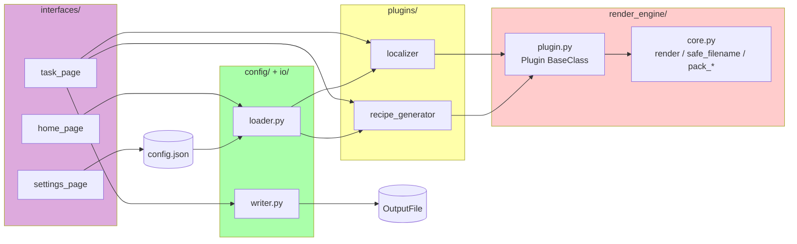

[中文版](README.zh-CN.md) | English

# Verdant Generator

> New Batch Generator · Verdant Leaves Edition

A batch generator for Minecraft mod development: templates in, files out.

This project is a fork of [Recipes Generator 2](https://github.com/Linlinange/recipes_generator2).
The codebase has been fully rewritten around a plugin-based rendering engine.

## Features

- Pure-text templates with `{name}` placeholder substitution.
- Plugin-based: each use case is a plugin that declares its template, data, and output.
- Filename and content handled separately: filenames are sanitized for Windows, content is untouched.
- Post-processing as a separate stage, with global and per-material rules.
- Flet GUI with task list, execution page, and settings page.
- Fully testable: the engine is stateless and pure-functional.

## Requirements

- Python 3.8+
- Flet (GUI) / pytest (development)

## Installation

```bash
python -m venv .venv
source .venv/Scripts/activate    # Windows Git Bash
# or .venv\Scripts\activate.bat  # Windows CMD
# or source .venv/bin/activate   # macOS / Linux

pip install -e ".[gui,dev]"
```

## Usage

Launch the GUI:

```bash
python run_flet.py
```

Or run from the command line:

```bash
python -c "
from verdant_generator.scheduler import Scheduler
r = Scheduler('./output').run_config_file('config.json')
print(f'Written: {r.total_written}, Failed: {r.total_failed}')
"
```

Run tests:

```bash
python -m pytest tests/ -v
```

## Configuration

```json
{
  "plugins": [
    {
      "type": "recipe_generator",
      "template": "templates/{tree}.json",
      "output_name": "{tree}.json",
      "trees": ["minecraft:oak", "minecraft:crimson"]
    },
    {
      "type": "localizer",
      "template": "templates/{material_id}.json",
      "output_name": "{material_id}.json",
      "materials": {
        "minecraft:oak": "橡木",
        "minecraft:crimson": "绯红"
      },
      "per_material_replacements": {
        "crimson": {"_log": "_stem"}
      }
    }
  ]
}
```

Notes:

- `template` points to the template file on disk.
- `output_name` is the output filename template (may contain placeholders).
- Full IDs like `minecraft:oak` automatically derive `{material_id}`, `{modid}`, `{modid_safe}`.
- `per_material_replacements` applies only to the specified material.

## Architecture



```
src/
└── verdant_generator/
    ├── render_engine/    Core engine (no dependencies)
    ├── plugins/          Built-in plugins
    ├── config/           JSON → Plugin instances
    ├── io/               OutputFile → disk
    ├── scheduler/        Runs plugins in order
    └── interfaces/       Flet GUI
```

Dependency direction is one-way:
`interfaces → scheduler → config → plugins → render_engine`.
`render_engine` depends on nothing above it and can be used standalone.

## Writing a plugin

Subclass `verdant_generator.render_engine.Plugin` and implement three methods:

```python
from verdant_generator.render_engine import Plugin


class MyPlugin(Plugin):
    @property
    def name(self): return "my_plugin"

    @property
    def description(self): return "My plugin"

    def template_path(self): return "templates/my_tpl.txt"

    def replacements(self):
        return [{"key": v} for v in ["a", "b", "c"]]

    def output_name_template(self): return "{key}.txt"
    def post_processor(self):
        return lambda text, combo: text.upper()
```

Register it in `PLUGIN_FACTORIES` inside `verdant_generator/config/loader.py`.

## License

MIT License. See [LICENSE](LICENSE) for details.

Original upstream copyright belongs to [Linlinange](https://github.com/Linlinange).
The rewritten code in this fork is also released under the MIT License.

## Credits

- Original project: [Recipes Generator 2](https://github.com/Linlinange/recipes_generator2) by Linlinange
- Refactored by: Sunny Verdant Leaves

The domain rules developed upstream (`木木 → 木`, `_log → _stem`, `modid` / `modid_safe`derivation, and others) are fully preserved in this rewrite.