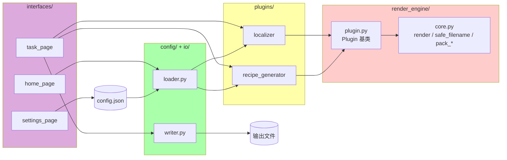

[English](README.md) | 中文版

# Verdant Generator

> 新版批量生成器 · 碧叶版

一个用于 Minecraft 模组开发的批量生成工具：输入模板，输出文件。

本项目 Fork 自 [Recipes Generator 2](https://github.com/Linlinange/recipes_generator2)，
代码已围绕插件式渲染引擎彻底重写。

## 功能

- 纯文本模板，`{name}` 占位符替换。
- 插件式：每个场景是一个插件，声明它用什么模板、用什么数据、怎么输出。
- 文件名与内容分离。文件名做 Windows 兼容处理，内容一字不动。
- 后处理作为独立阶段，支持全局规则和材质专属规则。
- Flet 图形界面：任务列表、执行页、设置页。
- 可测试：引擎无状态、纯函数，测试覆盖完整。

## 环境要求

- Python 3.8+
- Flet（图形界面）/ pytest（开发用）

## 安装

```bash
python -m venv .venv
source .venv/Scripts/activate    # Windows Git Bash
# 或 .venv\Scripts\activate.bat  # Windows CMD
# 或 source .venv/bin/activate   # macOS / Linux

pip install -e ".[gui,dev]"
```

## 使用

启动图形界面：

```bash
python run_flet.py
```

或者命令行运行：

```bash
python -c "
from verdant_generator.scheduler import Scheduler
r = Scheduler('./output').run_config_file('config.json')
print(f'写入 {r.total_written} 个，失败 {r.total_failed} 个')
"
```

跑测试：

```bash
python -m pytest tests/ -v
```

## 配置文件

```json
{
  "plugins": [
    {
      "type": "recipe_generator",
      "template": "templates/{tree}.json",
      "output_name": "{tree}.json",
      "trees": ["minecraft:oak", "minecraft:crimson"]
    },
    {
      "type": "localizer",
      "template": "templates/{material_id}.json",
      "output_name": "{material_id}.json",
      "materials": {
        "minecraft:oak": "橡木",
        "minecraft:crimson": "绯红"
      },
      "per_material_replacements": {
        "crimson": {"_log": "_stem"}
      }
    }
  ]
}
```

说明：

- `template` 是磁盘上的模板文件路径。
- `output_name` 是输出文件名模板，可以带占位符。
- 完整 ID（如 `minecraft:oak`）会自动派生：
  - `{material_id}` / `{tree}` → 短名（`oak`）
  - `{modid}` → mod id，不带冒号（`minecraft`）
- `per_material_replacements` 只对指定材质生效。

## 架构



```
src/
└── verdant_generator/
    ├── render_engine/    核心引擎（无依赖）
    ├── plugins/          内置插件
    ├── config/           JSON → Plugin 实例
    ├── io/               OutputFile → 磁盘
    ├── scheduler/        按顺序执行插件
    └── interfaces/       Flet 图形界面
```

依赖方向单向：`interfaces → scheduler → config → plugins → render_engine`。
`render_engine` 不依赖任何上层，可以单独使用。

## 编写插件

继承 `verdant_generator.render_engine.Plugin`，实现三个方法：

```python
from verdant_generator.render_engine import Plugin


class MyPlugin(Plugin):
    @property
    def name(self): return "my_plugin"

    @property
    def description(self): return "我的插件"

    def template_path(self): return "templates/my_tpl.txt"

    def replacements(self):
        return [{"key": v} for v in ["a", "b", "c"]]

    def output_name_template(self): return "{key}.txt"
    def post_processor(self):
        return lambda text, combo: text.upper()
```

在 `verdant_generator/config/loader.py` 的 `PLUGIN_FACTORIES` 里注册即可使用。

## 许可证

本项目基于 MIT 许可证开源。完整协议见 [LICENSE](LICENSE)。

上游原始版权归 [Linlinange](https://github.com/Linlinange) 所有。
本 Fork 中的重写代码同样以 MIT 协议发布。

## 致谢

- 原始项目：[Recipes Generator 2](https://github.com/Linlinange/recipes_generator2)，作者 Linlinange
- 重构：Sunny Verdant Leaves

上游项目打磨出的领域规则（`木木 → 木`、`_log → _stem`、`modid` / `modid_safe` 派生等）在本次重写中完整保留。
